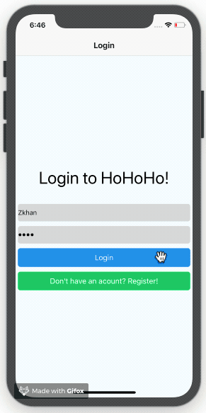

# Ho_Ho_Ho_App

Ho_Ho_Ho_App is a simplified clone of the [Yo
app](https://www.justyo.co/), a "contextual messenger" that lets us send a
simple "Yo" message to friends. Ho_Ho_Ho_App lets us send a "HoHoHo" message (single click) to friends as well as share our locations (press and hold) with them. This app is built using React Native and can be run on the mobile platform of our choice, iOS or Android.

